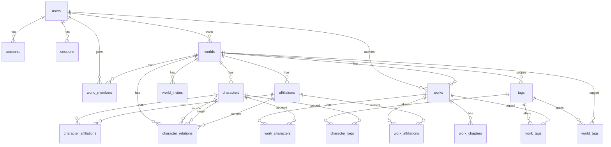

# 데이터 모델 설계서

## 1. 문서 목적

이 문서는 `AGENTS.md`와 `docs/requirements.md`를 기준으로 세계관/자캐/창작 공유 플랫폼의 PostgreSQL 데이터 모델을 정의한다. Prisma 7.8.0으로 구현할 것을 전제로 하되, 실제 스키마 작성 전에는 현재 설치된 Prisma 및 NextAuth 관련 문서를 확인한다.

## 2. 설계 원칙

- 세계관은 최상위 소유 및 공유 단위다.
- 캐릭터, 소속, 관계, 창작물, 챕터, 태그 연결은 모두 세계관 경계 안에서 관리한다.
- 하위 리소스는 `world_id`를 명시적으로 가진다.
- 서로 다른 세계관의 리소스가 연결되지 않도록 복합 외래 키 또는 서버 검증을 사용한다.
- 공개 범위는 세계관 공개 범위와 리소스 공개 범위를 함께 계산한다.
- 장문 창작물은 작품 기본 정보와 본문 단위를 분리해 관리한다.
- 목록 조회와 권한 검증이 잦은 컬럼에는 인덱스를 둔다.

## 3. 공통 규칙

- 기본 키: PostgreSQL `uuid`
- UUID 생성: `gen_random_uuid()` 사용 권장
- 시간 컬럼: `timestamptz`
- 논리 삭제 대상: `worlds`, `characters`, `affiliations`, `character_relations`, `works`, `work_chapters`
- 공통 감사 컬럼: `created_at`, `updated_at`, 필요 시 `deleted_at`
- 사용자 입력 장문: `text`
- 유연한 프로필/설정 확장 필드: `jsonb`
- URL용 식별자: `slug`
- Prisma 모델명은 PascalCase, 실제 테이블명은 snake_case 사용을 권장한다.

## 4. 핵심 ERD

## 5. Enum 설계

| Enum | 값 | 설명 |
| --- | --- | --- |
| `Visibility` | `PRIVATE`, `SHARED`, `PUBLIC` | 세계관 및 하위 리소스 공개 범위 |
| `WorldRole` | `OWNER`, `ADMIN`, `EDITOR`, `VIEWER` | 세계관 멤버 권한 |
| `InviteStatus` | `PENDING`, `ACCEPTED`, `REVOKED`, `EXPIRED` | 세계관 초대 상태 |
| `AffiliationType` | `COUNTRY`, `ORGANIZATION`, `FACTION`, `FAMILY`, `SCHOOL`, `GUILD`, `SPECIES`, `FORCE`, `OTHER` | 소속 유형 |
| `CharacterAffiliationStatus` | `CURRENT`, `FORMER`, `UNKNOWN` | 캐릭터의 소속 상태 |
| `RelationDirection` | `DIRECTED`, `BIDIRECTIONAL` | 관계 방향성 |
| `RelationStatus` | `ACTIVE`, `PAST`, `RUMORED`, `ENDED`, `UNKNOWN` | 관계 상태 |
| `WorkType` | `NOVEL`, `ROLEPLAY`, `SETTING_NOTE`, `SHORT_STORY`, `EPISODE`, `OTHER` | 창작물 유형 |
| `PublishStatus` | `DRAFT`, `PUBLISHED`, `ARCHIVED` | 창작물 게시 상태 |
| `WorkCharacterRole` | `MAIN`, `SUPPORTING`, `MENTIONED`, `POV`, `OTHER` | 창작물 내 캐릭터 역할 |
| `TagScope` | `GLOBAL`, `WORLD` | 태그 범위 |

## 6. 인증 모델

NextAuth session 방식을 기준으로 표준 Adapter 모델을 둔다. 이메일/비밀번호 회원가입을 지원할 경우 `users.password_hash`를 사용하고, OAuth만 지원할 경우 nullable로 둔다.

### 6.1 `users`

| 컬럼 | 타입 | 제약 | 설명 |
| --- | --- | --- | --- |
| `id` | `uuid` | PK | 사용자 ID |
| `name` | `varchar(80)` | nullable | 표시 이름 |
| `email` | `citext` | unique, nullable | 이메일 |
| `email_verified` | `timestamptz` | nullable | 이메일 인증 시각 |
| `image` | `text` | nullable | 프로필 이미지 URL |
| `password_hash` | `text` | nullable | credentials 로그인용 해시 |
| `bio` | `text` | nullable | 사용자 소개 |
| `created_at` | `timestamptz` | not null | 생성 시각 |
| `updated_at` | `timestamptz` | not null | 수정 시각 |
| `deleted_at` | `timestamptz` | nullable | 탈퇴 또는 논리 삭제 시각 |

주요 인덱스:

- `unique(email)`
- `index(created_at)`

### 6.2 `accounts`

| 컬럼 | 타입 | 제약 | 설명 |
| --- | --- | --- | --- |
| `id` | `uuid` | PK | 계정 연결 ID |
| `user_id` | `uuid` | FK `users.id`, cascade | 사용자 |
| `type` | `varchar(40)` | not null | provider 타입 |
| `provider` | `varchar(80)` | not null | provider 이름 |
| `provider_account_id` | `varchar(255)` | not null | provider 사용자 ID |
| `refresh_token` | `text` | nullable | OAuth refresh token |
| `access_token` | `text` | nullable | OAuth access token |
| `expires_at` | `integer` | nullable | 만료 시각 |
| `token_type` | `varchar(40)` | nullable | 토큰 타입 |
| `scope` | `text` | nullable | OAuth scope |
| `id_token` | `text` | nullable | ID token |
| `session_state` | `text` | nullable | provider session state |

주요 제약:

- `unique(provider, provider_account_id)`
- `index(user_id)`

### 6.3 `sessions`

| 컬럼 | 타입 | 제약 | 설명 |
| --- | --- | --- | --- |
| `id` | `uuid` | PK | 세션 ID |
| `session_token` | `text` | unique | 세션 토큰 |
| `user_id` | `uuid` | FK `users.id`, cascade | 사용자 |
| `expires` | `timestamptz` | not null | 세션 만료 시각 |

주요 인덱스:

- `unique(session_token)`
- `index(user_id)`
- `index(expires)`

### 6.4 `verification_tokens`

| 컬럼 | 타입 | 제약 | 설명 |
| --- | --- | --- | --- |
| `identifier` | `text` | not null | 이메일 또는 식별자 |
| `token` | `text` | not null | 검증 토큰 |
| `expires` | `timestamptz` | not null | 만료 시각 |

주요 제약:

- `unique(token)`
- `unique(identifier, token)`

## 7. 세계관 및 공유 모델

### 7.1 `worlds`

| 컬럼 | 타입 | 제약 | 설명 |
| --- | --- | --- | --- |
| `id` | `uuid` | PK | 세계관 ID |
| `owner_id` | `uuid` | FK `users.id`, restrict | 세계관 소유자 |
| `title` | `varchar(120)` | not null | 세계관 제목 |
| `slug` | `varchar(160)` | unique | 공개 URL 식별자 |
| `description` | `text` | nullable | 세계관 소개 |
| `genre` | `varchar(80)` | nullable | 장르 |
| `cover_image_url` | `text` | nullable | 커버 이미지 |
| `visibility` | `Visibility` | not null, default `PRIVATE` | 공개 범위 |
| `settings` | `jsonb` | not null, default `{}` | 세계관별 설정 |
| `view_count` | `bigint` | not null, default `0` | 공개 탐색 인기순 정렬용 누적 조회수 |
| `created_at` | `timestamptz` | not null | 생성 시각 |
| `updated_at` | `timestamptz` | not null | 수정 시각 |
| `deleted_at` | `timestamptz` | nullable | 논리 삭제 시각 |

주요 인덱스:

- `unique(slug)`
- `check(view_count >= 0)`
- `index(owner_id, updated_at desc)`
- `index(visibility, updated_at desc)`
- `index(visibility, view_count desc, updated_at desc)`
- `index(deleted_at)`

무결성 규칙:

- `owner_id` 사용자는 `world_members`에 `OWNER`로도 존재해야 한다.
- 단일 소유자 정책을 유지한다면 `world_members`에는 `role = 'OWNER'`인 행이 세계관당 1개만 존재해야 한다.
- 세계관 공개 범위가 `PRIVATE`이면 하위 리소스가 `PUBLIC`이어도 외부 공개되지 않는다.
- `view_count`는 음수가 될 수 없으며, 조회 이벤트 집계 또는 비동기 카운터 갱신으로 증가시킨다.

### 7.2 `world_members`

| 컬럼 | 타입 | 제약 | 설명 |
| --- | --- | --- | --- |
| `id` | `uuid` | PK | 멤버십 ID |
| `world_id` | `uuid` | FK `worlds.id`, cascade | 세계관 |
| `user_id` | `uuid` | FK `users.id`, cascade | 사용자 |
| `role` | `WorldRole` | not null | 권한 |
| `invited_by_id` | `uuid` | FK `users.id`, nullable | 초대한 사용자 |
| `created_at` | `timestamptz` | not null | 생성 시각 |
| `updated_at` | `timestamptz` | not null | 수정 시각 |

주요 제약:

- `unique(world_id, user_id)`
- `index(user_id, role)`
- `index(world_id, role)`

권한 규칙:

- `OWNER`는 세계관 삭제와 소유권 관리 권한을 가진다.
- `ADMIN`은 멤버 관리와 주요 편집 권한을 가진다.
- `EDITOR`는 캐릭터, 소속, 관계, 창작물을 생성/수정할 수 있다.
- `VIEWER`는 읽기 권한만 가진다.

### 7.3 `world_invites`

| 컬럼 | 타입 | 제약 | 설명 |
| --- | --- | --- | --- |
| `id` | `uuid` | PK | 초대 ID |
| `world_id` | `uuid` | FK `worlds.id`, cascade | 세계관 |
| `email` | `citext` | nullable | 초대 이메일 |
| `invitee_user_id` | `uuid` | FK `users.id`, nullable | 초대 대상 사용자 |
| `role` | `WorldRole` | not null | 수락 시 부여할 권한 |
| `token_hash` | `text` | unique | 초대 토큰 해시 |
| `status` | `InviteStatus` | not null, default `PENDING` | 초대 상태 |
| `invited_by_id` | `uuid` | FK `users.id` | 초대한 사용자 |
| `expires_at` | `timestamptz` | nullable | 만료 시각 |
| `created_at` | `timestamptz` | not null | 생성 시각 |
| `accepted_at` | `timestamptz` | nullable | 수락 시각 |

주요 인덱스:

- `index(world_id, status)`
- `index(email, status)`
- `index(invitee_user_id, status)`

MVP에서 초대 링크를 만들지 않는다면 `world_members`만으로 특정 사용자 공유를 먼저 구현할 수 있다.

## 8. 캐릭터 및 소속 모델

### 8.1 `characters`

| 컬럼 | 타입 | 제약 | 설명 |
| --- | --- | --- | --- |
| `id` | `uuid` | PK | 캐릭터 ID |
| `world_id` | `uuid` | FK `worlds.id`, cascade | 소속 세계관 |
| `created_by_id` | `uuid` | FK `users.id`, nullable | 생성자 |
| `name` | `varchar(120)` | not null | 캐릭터 이름 |
| `alias` | `varchar(160)` | nullable | 별칭 |
| `profile_image_url` | `text` | nullable | 프로필 이미지 |
| `summary` | `varchar(240)` | nullable | 한 줄 소개 |
| `description` | `text` | nullable | 상세 설정 |
| `personality` | `text` | nullable | 성격 |
| `background` | `text` | nullable | 배경 |
| `profile` | `jsonb` | not null, default `{}` | 추가 프로필 필드 |
| `visibility` | `Visibility` | not null, default `PRIVATE` | 캐릭터 공개 범위 |
| `view_count` | `bigint` | not null, default `0` | 공개 탐색 인기순 정렬용 누적 조회수 |
| `created_at` | `timestamptz` | not null | 생성 시각 |
| `updated_at` | `timestamptz` | not null | 수정 시각 |
| `deleted_at` | `timestamptz` | nullable | 논리 삭제 시각 |

주요 제약:

- `unique(id, world_id)` for composite FK
- `check(view_count >= 0)`
- `index(world_id, visibility, updated_at desc)`
- `index(visibility, view_count desc, updated_at desc)`
- `index(created_by_id, updated_at desc)`

대표 소속:

- 대표 소속은 `character_affiliations.is_primary = true`로 표현한다.
- PostgreSQL partial unique index로 캐릭터당 활성 대표 소속을 1개만 허용한다.
- 공개 캐릭터 탐색의 인기순 정렬은 MVP에서 `view_count desc, updated_at desc`를 기준으로 한다.

### 8.2 `affiliations`

| 컬럼 | 타입 | 제약 | 설명 |
| --- | --- | --- | --- |
| `id` | `uuid` | PK | 소속 ID |
| `world_id` | `uuid` | FK `worlds.id`, cascade | 세계관 |
| `parent_id` | `uuid` | composite FK `(parent_id, world_id)`, nullable | 상위 소속 |
| `name` | `varchar(120)` | not null | 소속 이름 |
| `type` | `AffiliationType` | not null, default `OTHER` | 소속 유형 |
| `description` | `text` | nullable | 설명 |
| `symbol_image_url` | `text` | nullable | 상징 이미지 |
| `color` | `varchar(20)` | nullable | 대표 색상 |
| `visibility` | `Visibility` | not null, default `PRIVATE` | 소속 공개 범위 |
| `created_at` | `timestamptz` | not null | 생성 시각 |
| `updated_at` | `timestamptz` | not null | 수정 시각 |
| `deleted_at` | `timestamptz` | nullable | 논리 삭제 시각 |

주요 제약:

- `unique(id, world_id)` for composite FK
- `index(world_id, type, name)`
- `index(parent_id)`

조회수 정책:

- MVP에서 소속은 독립 공개 탐색 대상이 아니라 세계관 내부의 분류, 필터, 그룹핑 기준으로 사용한다.
- 따라서 `affiliations`에는 `view_count`를 두지 않고, 기본 정렬은 `name`, `updated_at` 등을 사용한다.

삭제 정책:

- MVP에서는 논리 삭제를 기본으로 한다.
- 논리 삭제된 소속은 목록에서 제외하되, 과거 소속 이력은 보존한다.
- 물리 삭제가 필요한 경우 `character_affiliations`, `work_affiliations`, 관계의 `context_affiliation_id` 처리 정책을 먼저 적용한다.

### 8.3 `character_affiliations`

| 컬럼 | 타입 | 제약 | 설명 |
| --- | --- | --- | --- |
| `id` | `uuid` | PK | 캐릭터-소속 연결 ID |
| `world_id` | `uuid` | FK `worlds.id`, cascade | 세계관 |
| `character_id` | `uuid` | composite FK `(character_id, world_id)` | 캐릭터 |
| `affiliation_id` | `uuid` | composite FK `(affiliation_id, world_id)` | 소속 |
| `title` | `varchar(120)` | nullable | 직책 |
| `rank` | `varchar(120)` | nullable | 계급 |
| `status` | `CharacterAffiliationStatus` | not null, default `CURRENT` | 현재/과거 상태 |
| `started_label` | `varchar(120)` | nullable | 가입 시점 표시값 |
| `ended_label` | `varchar(120)` | nullable | 종료 시점 표시값 |
| `note` | `text` | nullable | 메모 |
| `is_primary` | `boolean` | not null, default `false` | 대표 소속 여부 |
| `created_at` | `timestamptz` | not null | 생성 시각 |
| `updated_at` | `timestamptz` | not null | 수정 시각 |

주요 제약:

- `index(world_id, affiliation_id, status)`
- `index(world_id, character_id, status)`
- `index(character_id, is_primary)`
- partial unique: `unique(character_id) where is_primary = true and status = 'CURRENT'`
- partial unique: `unique(character_id, affiliation_id) where status = 'CURRENT'`

세계관 무결성:

- `character_id`와 `affiliation_id`는 같은 `world_id`를 가져야 한다.
- `is_primary = true`는 현재 소속인 `CURRENT` 연결에만 허용한다.
- Prisma에서 복합 FK를 사용하기 어렵다면 서버 액션/API에서 같은 세계관 여부를 반드시 검증한다.

## 9. 관계도 모델

### 9.1 `character_relations`

| 컬럼 | 타입 | 제약 | 설명 |
| --- | --- | --- | --- |
| `id` | `uuid` | PK | 관계 ID |
| `world_id` | `uuid` | FK `worlds.id`, cascade | 세계관 |
| `source_character_id` | `uuid` | composite FK `(source_character_id, world_id)` | 출발 캐릭터 |
| `target_character_id` | `uuid` | composite FK `(target_character_id, world_id)` | 대상 캐릭터 |
| `context_affiliation_id` | `uuid` | composite FK `(context_affiliation_id, world_id)`, nullable | 관계 맥락 소속 |
| `label` | `varchar(120)` | not null | 관계명 |
| `description` | `text` | nullable | 관계 설명 |
| `direction` | `RelationDirection` | not null, default `DIRECTED` | 방향성 |
| `status` | `RelationStatus` | not null, default `ACTIVE` | 관계 상태 |
| `visibility` | `Visibility` | not null, default `PRIVATE` | 관계 공개 범위 |
| `created_by_id` | `uuid` | FK `users.id`, nullable | 생성자 |
| `created_at` | `timestamptz` | not null | 생성 시각 |
| `updated_at` | `timestamptz` | not null | 수정 시각 |
| `deleted_at` | `timestamptz` | nullable | 논리 삭제 시각 |

주요 제약:

- `check(source_character_id <> target_character_id)`
- `unique(id, world_id)` for composite FK
- `index(world_id, source_character_id)`
- `index(world_id, target_character_id)`
- `index(world_id, context_affiliation_id)`
- `index(world_id, status, updated_at desc)`

관계도 조회:

- 그래프 노드는 `characters`를 사용한다.
- 그래프 엣지는 `character_relations`를 사용한다.
- 소속별 그룹핑과 색상 표시는 `character_affiliations`, `affiliations.color`, `context_affiliation_id`를 함께 조회한다.

## 10. 창작물 모델

### 10.1 `works`

| 컬럼 | 타입 | 제약 | 설명 |
| --- | --- | --- | --- |
| `id` | `uuid` | PK | 창작물 ID |
| `world_id` | `uuid` | FK `worlds.id`, cascade | 세계관 |
| `author_id` | `uuid` | FK `users.id`, nullable | 창작자 |
| `title` | `varchar(180)` | not null | 제목 |
| `type` | `WorkType` | not null | 창작물 유형 |
| `summary` | `text` | nullable | 요약 |
| `cover_image_url` | `text` | nullable | 커버 이미지 |
| `visibility` | `Visibility` | not null, default `PRIVATE` | 공개 범위 |
| `publish_status` | `PublishStatus` | not null, default `DRAFT` | 게시 상태 |
| `is_official` | `boolean` | not null, default `false` | 공식 창작물 여부 |
| `view_count` | `bigint` | not null, default `0` | 공개 탐색 인기순 정렬용 누적 조회수 |
| `created_at` | `timestamptz` | not null | 생성 시각 |
| `updated_at` | `timestamptz` | not null | 수정 시각 |
| `published_at` | `timestamptz` | nullable | 공개 시각 |
| `deleted_at` | `timestamptz` | nullable | 논리 삭제 시각 |

주요 제약:

- `unique(id, world_id)` for composite FK
- `check(view_count >= 0)`
- `index(world_id, type, updated_at desc)`
- `index(world_id, visibility, publish_status, updated_at desc)`
- `index(visibility, publish_status, view_count desc, updated_at desc)`
- `index(author_id, updated_at desc)`
- `index(world_id, is_official, updated_at desc)`

공식 창작물 규칙:

- `author_id`는 창작자의 식별 정보다.
- 생성 시점에 작성자가 해당 세계관의 `OWNER`, `ADMIN`, `EDITOR`라면 `is_official = true`로 저장한다.
- 화면에서는 `is_official`을 `official` 배지 또는 태그처럼 표시한다.
- 사용자 편집 태그와 구분하기 위해 공식 여부의 진실값은 `work_tags`가 아니라 `works.is_official`을 기준으로 한다.
- 공개 창작물 탐색의 인기순 정렬은 MVP에서 `view_count desc, updated_at desc`를 기준으로 한다.

### 10.2 `work_chapters`

| 컬럼 | 타입 | 제약 | 설명 |
| --- | --- | --- | --- |
| `id` | `uuid` | PK | 챕터 ID |
| `world_id` | `uuid` | FK `worlds.id`, cascade | 세계관 |
| `work_id` | `uuid` | composite FK `(work_id, world_id)`, cascade | 창작물 |
| `title` | `varchar(180)` | not null | 챕터 제목 |
| `sort_order` | `integer` | not null | 정렬 순서 |
| `body_text` | `text` | nullable | 텍스트/Markdown 본문 |
| `visibility` | `Visibility` | nullable | 챕터별 공개 범위, null이면 작품 상속 |
| `publish_status` | `PublishStatus` | not null, default `DRAFT` | 게시 상태 |
| `created_at` | `timestamptz` | not null | 생성 시각 |
| `updated_at` | `timestamptz` | not null | 수정 시각 |
| `published_at` | `timestamptz` | nullable | 공개 시각 |
| `deleted_at` | `timestamptz` | nullable | 논리 삭제 시각 |

주요 제약:

- `unique(work_id, sort_order)`
- `index(world_id, work_id, sort_order)`
- `index(work_id, publish_status, sort_order)`

### 10.3 `work_characters`

| 컬럼 | 타입 | 제약 | 설명 |
| --- | --- | --- | --- |
| `id` | `uuid` | PK | 창작물-캐릭터 연결 ID |
| `world_id` | `uuid` | FK `worlds.id`, cascade | 세계관 |
| `work_id` | `uuid` | composite FK `(work_id, world_id)`, cascade | 창작물 |
| `character_id` | `uuid` | composite FK `(character_id, world_id)`, cascade | 등장 캐릭터 |
| `role` | `WorkCharacterRole` | not null, default `MENTIONED` | 작품 내 역할 |
| `note` | `text` | nullable | 메모 |
| `sort_order` | `integer` | not null, default `0` | 정렬 순서 |
| `created_at` | `timestamptz` | not null | 생성 시각 |

주요 제약:

- `unique(work_id, character_id)`
- `index(world_id, character_id)`
- `index(world_id, work_id, sort_order)`

### 10.4 `work_affiliations`

| 컬럼 | 타입 | 제약 | 설명 |
| --- | --- | --- | --- |
| `id` | `uuid` | PK | 창작물-소속 연결 ID |
| `world_id` | `uuid` | FK `worlds.id`, cascade | 세계관 |
| `work_id` | `uuid` | composite FK `(work_id, world_id)`, cascade | 창작물 |
| `affiliation_id` | `uuid` | composite FK `(affiliation_id, world_id)`, cascade | 관련 소속 |
| `note` | `text` | nullable | 메모 |
| `sort_order` | `integer` | not null, default `0` | 정렬 순서 |
| `created_at` | `timestamptz` | not null | 생성 시각 |

주요 제약:

- `unique(work_id, affiliation_id)`
- `index(world_id, affiliation_id)`
- `index(world_id, work_id, sort_order)`

## 11. 태그 모델

태그는 탐색과 분류를 위한 사용자 편집 데이터다. `official` 여부처럼 권한 기반으로 결정되는 시스템 상태는 태그가 아니라 별도 컬럼을 사용한다.

태그 입력 규칙:

- 세계관, 캐릭터, 창작물 생성/수정 화면은 `#태그1 #태그2 #태그3` 형태의 문자열 입력을 받는다.
- 저장 시 `#`를 제거하고 공백 기준으로 분리해 태그명을 추출한다.
- 같은 이름의 태그가 현재 범위에 이미 있으면 기존 `tags` 행을 사용하고, 없으면 새 `tags` 행을 생성한다.
- 이후 대상 리소스의 ID와 태그 ID로 `world_tags`, `character_tags`, `work_tags` 연결 행을 생성하거나 갱신한다.

### 11.1 `tags`

| 컬럼 | 타입 | 제약 | 설명 |
| --- | --- | --- | --- |
| `id` | `uuid` | PK | 태그 ID |
| `scope` | `TagScope` | not null | 전역/세계관 범위 |
| `world_id` | `uuid` | FK `worlds.id`, nullable | 세계관 범위 태그일 때 사용 |
| `name` | `varchar(80)` | not null | 태그명 |
| `slug` | `varchar(100)` | not null | 태그 식별자 |
| `color` | `varchar(20)` | nullable | 표시 색상 |
| `created_by_id` | `uuid` | FK `users.id`, nullable | 생성자 |
| `created_at` | `timestamptz` | not null | 생성 시각 |

주요 제약:

- check: `scope = 'GLOBAL'`이면 `world_id is null`
- check: `scope = 'WORLD'`이면 `world_id is not null`
- partial unique: `unique(slug) where scope = 'GLOBAL' and world_id is null`
- partial unique: `unique(world_id, slug) where scope = 'WORLD' and world_id is not null`
- `index(world_id, slug)`

### 11.2 `world_tags`

| 컬럼 | 타입 | 제약 | 설명 |
| --- | --- | --- | --- |
| `world_id` | `uuid` | FK `worlds.id`, cascade | 세계관 |
| `tag_id` | `uuid` | FK `tags.id`, cascade | 태그 |
| `created_at` | `timestamptz` | not null | 생성 시각 |

주요 제약:

- PK 또는 unique `(world_id, tag_id)`
- `index(tag_id)`

### 11.3 `character_tags`

| 컬럼 | 타입 | 제약 | 설명 |
| --- | --- | --- | --- |
| `world_id` | `uuid` | FK `worlds.id`, cascade | 세계관 |
| `character_id` | `uuid` | composite FK `(character_id, world_id)`, cascade | 캐릭터 |
| `tag_id` | `uuid` | FK `tags.id`, cascade | 태그 |
| `created_at` | `timestamptz` | not null | 생성 시각 |

주요 제약:

- PK 또는 unique `(character_id, tag_id)`
- `index(world_id, tag_id)`

### 11.4 `work_tags`

| 컬럼 | 타입 | 제약 | 설명 |
| --- | --- | --- | --- |
| `world_id` | `uuid` | FK `worlds.id`, cascade | 세계관 |
| `work_id` | `uuid` | composite FK `(work_id, world_id)`, cascade | 창작물 |
| `tag_id` | `uuid` | FK `tags.id`, cascade | 태그 |
| `created_at` | `timestamptz` | not null | 생성 시각 |

주요 제약:

- PK 또는 unique `(work_id, tag_id)`
- `index(world_id, tag_id)`

## 12. 공개 범위 계산

리소스의 실제 공개 여부는 세계관 공개 범위와 리소스 공개 범위를 함께 계산한다.

| 세계관 `visibility` | 리소스 `visibility` | 비로그인 사용자 | 공유 사용자 |
| --- | --- | --- | --- |
| `PRIVATE` | any | 접근 불가 | 멤버 권한에 따라 접근 |
| `SHARED` | any | 접근 불가 | 멤버 권한에 따라 접근 |
| `PUBLIC` | `PRIVATE` | 접근 불가 | 멤버 권한에 따라 접근 |
| `PUBLIC` | `SHARED` | 접근 불가 | 멤버 권한에 따라 접근 |
| `PUBLIC` | `PUBLIC` | 접근 가능 | 접근 가능 |

목록 쿼리에서는 애플리케이션 후처리가 아니라 SQL 조건에서 접근 가능한 리소스만 반환해야 한다.
창작물과 챕터는 공개 범위가 `PUBLIC`이어도 `publish_status = 'PUBLISHED'`일 때만 비로그인 사용자에게 노출한다.

## 13. 삭제 정책

| 대상 | MVP 정책 | 비고 |
| --- | --- | --- |
| 사용자 | 논리 삭제 | 세션 제거, 작성 콘텐츠는 소유 정책에 따라 보존 |
| 세계관 | 논리 삭제 | 하위 리소스는 숨김 처리, 물리 삭제는 별도 purge 작업 |
| 세계관 멤버 | 물리 삭제 | 공유 해제 시 즉시 삭제 가능 |
| 초대 | 상태 변경 | `REVOKED`, `EXPIRED`로 변경 |
| 캐릭터 | 논리 삭제 | 관계도와 작품 연결에서 제외 |
| 소속 | 논리 삭제 | 과거 소속 이력 보존 |
| 캐릭터-소속 연결 | 물리 삭제 또는 이력 상태 변경 | 현재 소속 해제는 `FORMER` 전환 권장 |
| 관계 | 논리 삭제 | 그래프에서 제외 |
| 창작물 | 논리 삭제 | 챕터와 연결은 보존 |
| 챕터 | 논리 삭제 | 회차 복구 가능 |
| 조인 테이블 | 물리 삭제 | 부모 리소스 물리 삭제 시 cascade |

## 14. 주요 조회 패턴과 인덱스

### 14.1 내 작업실

목표:

- 내가 소유한 세계관
- 내가 공유받은 세계관
- 최근 수정 순 정렬

필요 인덱스:

- `worlds(owner_id, updated_at desc)`
- `world_members(user_id, role)`
- `worlds(updated_at desc)`

### 14.2 공개 탐색

목표:

- 공개 세계관 목록
- 공개 캐릭터 목록
- 공개 창작물 목록
- 키워드와 태그, 장르, 캐릭터, 소속 기준 필터
- 인기순 정렬은 MVP에서 `view_count desc, updated_at desc`를 기준으로 한다.
- 최신순 정렬은 `updated_at desc`를 기준으로 한다.

필요 인덱스:

- `worlds(visibility, updated_at desc)`
- `worlds(visibility, view_count desc, updated_at desc)`
- `characters(visibility, view_count desc, updated_at desc)`
- `works(world_id, visibility, publish_status, updated_at desc)`
- `works(visibility, publish_status, view_count desc, updated_at desc)`
- `world_tags(tag_id, world_id)`
- `character_tags(tag_id, character_id)`
- `work_tags(tag_id, work_id)`
- `work_characters(world_id, character_id)`
- `work_affiliations(world_id, affiliation_id)`

### 14.3 세계관 상세

목표:

- 세계관 기본 정보
- 캐릭터 목록
- 소속 목록
- 창작물 목록
- 멤버 권한

필요 인덱스:

- `characters(world_id, visibility, updated_at desc)`
- `affiliations(world_id, type, name)`
- `works(world_id, type, updated_at desc)`
- `world_members(world_id, user_id)`

### 14.4 관계도

목표:

- 캐릭터 100개, 관계 300개 규모에서 빠른 그래프 데이터 반환
- 소속별 그룹핑과 필터링

필요 인덱스:

- `characters(world_id, deleted_at)`
- `character_relations(world_id, source_character_id)`
- `character_relations(world_id, target_character_id)`
- `character_relations(world_id, context_affiliation_id)`
- `character_affiliations(world_id, character_id, status)`
- `character_affiliations(world_id, affiliation_id, status)`

### 14.5 창작물 편집

목표:

- 작품 기본 정보
- 챕터 목록
- 등장 캐릭터
- 관련 소속

필요 인덱스:

- `work_chapters(work_id, publish_status, sort_order)`
- `work_characters(world_id, work_id, sort_order)`
- `work_affiliations(world_id, work_id, sort_order)`

## 15. Prisma 구현 메모

- PostgreSQL datasource를 사용한다.
- UUID는 `@db.Uuid`로 매핑한다.
- `jsonb`는 Prisma `Json` 타입으로 매핑한다.
- `citext`를 사용할 경우 PostgreSQL extension 활성화가 필요하다.
- `gen_random_uuid()`를 사용할 경우 `pgcrypto` extension 활성화가 필요하다.
- 복합 FK를 위해 주요 테이블에 `@@unique([id, worldId])`를 추가한다.
- partial unique index는 Prisma 스키마만으로 표현이 제한될 수 있으므로 raw SQL migration을 사용한다.
- `updated_at`은 Prisma `@updatedAt` 사용을 권장한다.
- 실제 모델 작성 전 `node_modules/next/dist/docs/`와 Prisma 7.8.0 문서를 확인한다.

## 16. MVP 우선 구현 테이블

MVP에서 우선 구현할 테이블:

- `users`
- `accounts`
- `sessions`
- `verification_tokens`
- `worlds`
- `world_members`
- `characters`
- `affiliations`
- `character_affiliations`
- `character_relations`
- `works`
- `work_chapters`
- `work_characters`
- `work_affiliations`
- `tags`
- `world_tags`
- `character_tags`
- `work_tags`

MVP 이후 구현 후보:

- `world_invites`
- 변경 이력 테이블
- 댓글 테이블
- 좋아요/북마크 테이블
- 첨부 파일 테이블
- 신고/차단 테이블
- 전문 검색용 materialized view 또는 `tsvector` 컬럼
